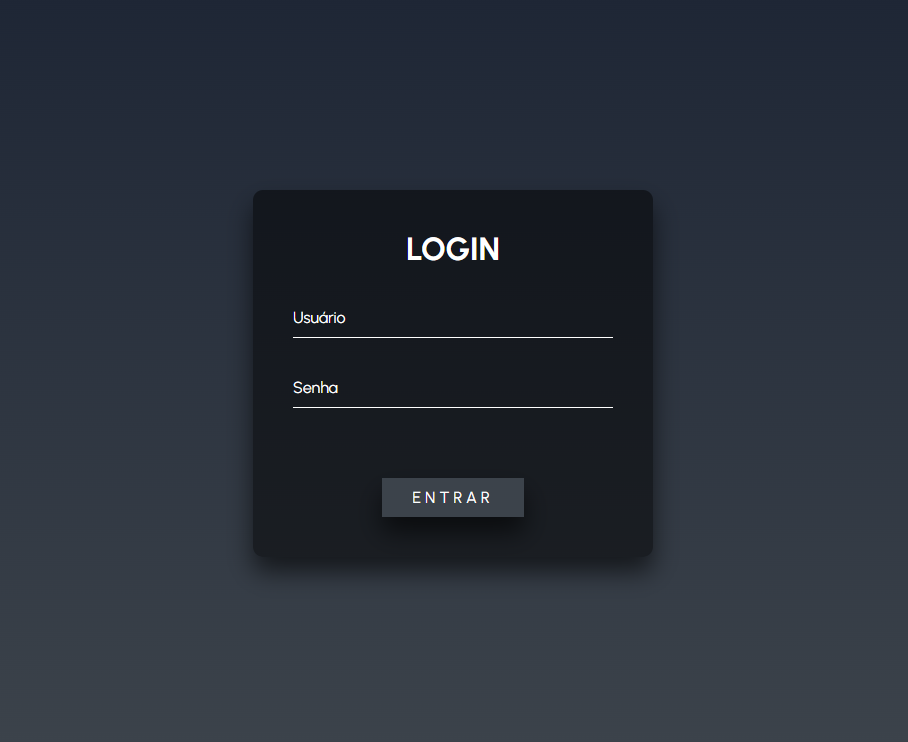
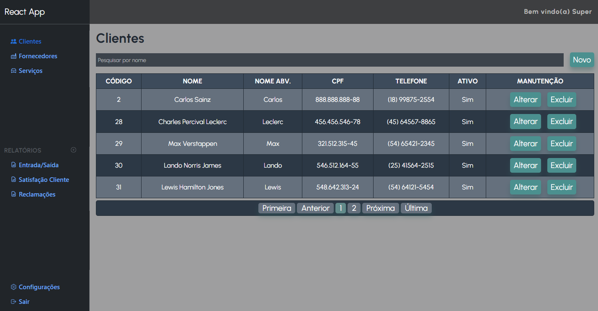

#  App React Full-Stack

 

 

Projeto com o objetivo de desenvolver uma aplicação full-stack, utilizando React no front-end e Node.js no back-end.

Como esse projeto tem como principal foco o estudo, um capíulo desse README será dedicado a criação do projeto do zero, com explicações essenciais.

## 🔧 Tecnologias Utilizadas 

### Front-end:


### Back-end:


### Banco de Dados:


### Editor: Visual Studio Code


## 📚 Descrição do Projeto

O principal objetivo deste projeto é estudar o desenvolvimento de uma aplicação full-stack para o mundo real. O exemplo que ele se baseia é de um ERP, que é um sistema de informação que interliga todos os dados e processos de uma organização em um único sistema.

## Estrutura do projeto

```
    react-app-full-stack/
    ├── backend/
    │   ├── node_modules/
    │   ├── src/
    │   │   ├── controllers/
    │   │   ├── middlewares/
    │   │   ├── models/
    │   │   ├── routes/
    |   │   ├── utils/
    │   │   ├── config.js
    │   │   └── server.js
    │   ├── .env
    │   ├── package.json
    │   └── package-lock.json
    │
    └── frontend/
    |    ├── node_modules/
    |    ├── public/
    |    ├── src/
    |    │   ├── components/
    |    │   ├── pages/
    |    │   ├── services/
    |    │   ├── utils/
    |    │   ├── App.js
    |    │   ├── index.js
    |    │   └── index.css
    |    ├── package.json
    |    └── package-lock.json
    ├── .gitattributes
    ├── .gitignore
    ├── LICENSE
    ├── README.md
```

A pasta **"backend"** contém a lógica do servidor **Node.js** e a interação com o banco de dados **MySQL**. Dentro dela, temos os seguintes elementos:

* **node_modules**: pasta onde são armazenadas as dependências do projeto. Criada automaticamente quando as dependências são instaladas.

* **src**: pasta que contém todo o código fonte do back-end.

* **controllers**: pasta para armazenar os controladores que lidam com as requisições HTTP.

* **models**: pasta para armazenar os modelos de dados e as interações com o banco de dados.

* **routes**: pasta para armazenar as definições de rotas e endpoints da API.

* **config.js**: arquivo de configuração para armazenar informações sensíveis, como as credenciais do banco de dados.

* **server.js**: arquivo principal que inicia o servidor Node.js e define a lógica de roteamento.

A pasta **"frontend"** contém o código do aplicativo React. Dentro dela, temos os seguintes elementos:

* **node_modules**: pasta onde são armazenadas as dependências do projeto. Será criada automaticamente quando você instalar as dependências usando o npm.
* **public**: pasta onde você coloca arquivos estáticos, como o arquivo HTML principal e outros recursos públicos.
* **src**: pasta que contém todo o código fonte do front-end.
* **components**: pasta para armazenar os componentes React reutilizáveis.
* **pages**: pasta para armazenar as páginas do aplicativo.
* **services**: pasta para armazenar os serviços de comunicação com o back-end, como chamadas de API.
* **App.js**: componente principal que define a estrutura do aplicativo React.
* **index.js**: ponto de entrada do aplicativo React.
* **index.css**: arquivo de estilo global para o aplicativo.

Os arquivos **".gitignore"**, **"package.json"** e **"package-lock.json"** são arquivos necessários para o gerenciamento de versão e as dependências do projeto.

## 🚀 Instalação

Siga os passos abaixo para configurar e executar o projeto localmente.

### 📋 Pré-requisitos 

- Node.js (versão 18.14.1 ou superior) [link para download](https://nodejs.org/)
- MySQL (versão 8.0.33 ou superior) [link para download](https://www.mysql.com/)
- Visual Studio Code (ou outro editor de sua preferência) [link para download](https://code.visualstudio.com/)

### 📥 Clonar o repositório

```
git clone https://github.com/seu-usuario/react-app-full-stack.git
cd react-app-full-stack
```

### ⚙️ Configuração do Banco de Dados

Crie um banco de dados MySQL para o projeto.
Renomeie o arquivo .env.example para .env.
Edite o arquivo .env e insira as informações do banco de dados:

```
    # Porta servidor node (backend)
    PORT="PORTA_SERVIDOR"

    # Configurações Banco de Dados
    MYSQL_PORT="SUA_PORTA_MYSQL"
    MYSQL_HOST="SEU_HOST_MYSQL"
    MYSQL_USER="SEU_USUARIO_MYSQL"
    MYSQL_PASSWORD="SUA_SENHA_MYSQL"
    MYSQL_DB="NOME_DO_SEU_BANCO"

    # Chave secreta para o Token
    SECRET_KEY="NODE BACKEND/SRC/UTILS/generateSecretKey.js"
```

### 📦 Instalação das dependências

Na pasta raiz do projeto, execute os seguintes comandos:

* Acessar pasta do back-end (Node.js)

    ```
    cd backend
    ```

* Instalar dependências do back-end (Node.js)

    ```
     npm install
    ```

* Acessar pasta do front-end (React)

    ```
    cd frontend
    ```

* Instalar dependências do front-end (React)

    ```
    npm install
    ```

## ▶️ Executando o projeto 

Na pasta raiz do projeto, execute os seguintes comandos:

* Executar o servidor Node.js (back-end)
    ```
    npm run start
    ```

* Executar o cliente React (front-end)

    ```
    cd frontend
    npm run start
    ```

O servidor estará sendo executado em http://localhost:3333 e o cliente React em http://localhost:3000.

## 🚀 Iniciando o Projeto do Zero 

Siga os passos abaixo para iniciar o projeto do zero em sua máquina.

### 🎉 Criando o projeto React 

Para criar o projeto React, execute o seguinte comando em seu terminal:

```bash
npx create-react-app react-app-full-stack
cd react-app-full-stack
```

### 🔧 Configurando o back-end com Node.js

Na pasta raiz do projeto, crie uma pasta para o back-end:

    ```bash
    mkdir backend
    cd backend
    ```

* Inicie um novo projeto Node.js:

    ```bash
    npm init -y
    ```

#### Instale as bibliotecas necessárias para o back-end:

* Instalação do MySQL para Node.js:

    ```bash
    npm install mysql2
    ```

* Instalação do express para Node.js:

    ```bash
    npm install express
    ```

* Instalação da biblioteca bcrypt para criptografia de senhas em Node.js:

    ```bash
    npm install bcrypt
    ```

* Instalação da biblioteca jsonwebtoken para lidar com tokens JWT em Node.js:

    ```bash
    npm install jsonwebtoken
    ```

* Instalação do dotenv para gerenciar as varáveis de ambiente em Node.js:

    ```bash
    npm install dotenv
    ```

* Instalação do cors para lidar com a política de segurança em Node.js:

    ```bash
    npm install cors
    ```


### 🔧 Configurando o front-end


## 👥 Contribuição 

Caso deseje contribuir para este projeto, siga os passos abaixo:

1. Faça um fork do repositório;

2. Crie um branch para a sua feature :
    ```
    git checkout -b feature/nome-da-feature
    ```
3. Faça as alterações desejadas;

4. Commit suas mudanças:
    ```
    git commit -m 'Adicionando nova feature'
    ```

4. Push o branch:
    ```
    git push origin feature/nome-da-feature
    ```

5. Abra um Pull Request;

## 📄 Licença

Este projeto está licenciado sob a Licença MIT License - veja o arquivo LICENSE.md para detalhes.